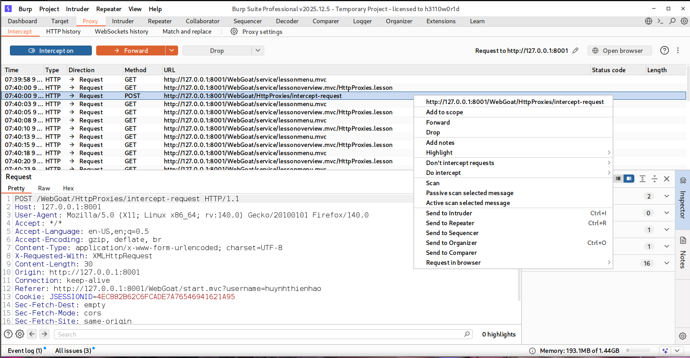
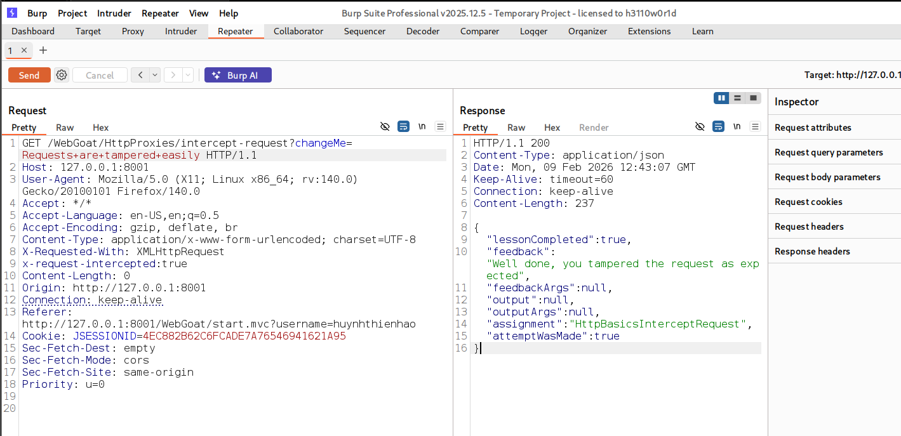
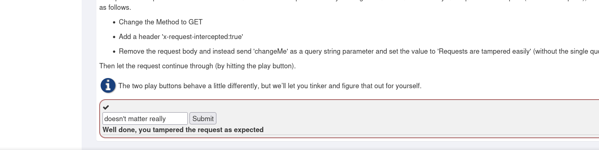
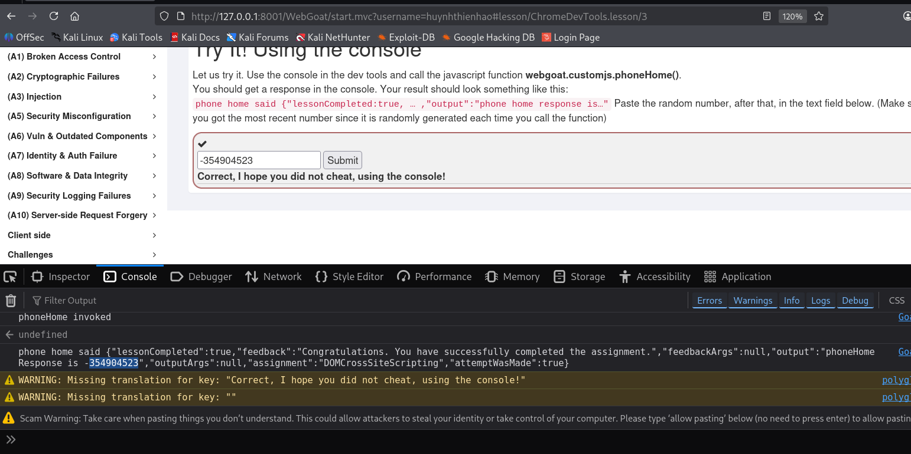

**HTTP Basics** 
-
*ex2*
-  
- Enter your name and press Go! -> Open F12 -> tab Network -> click request payload (POST)-> check response.

*ex3*
- 
- Use Developer Web -> choose tab Forms -> tick 'Dislay form detail' -> see result

**HTTP Proxies**
- 
*ex5*
- 
- click submit -> use burp suite -> click request and choose repeater.

- edit 

    Change the Method to GET

    Add a header 'x-request-intercepted:true'

    Remove the request body and instead send 'changeMe' as a query string parameter and set the value to 'Requests are tampered easily' (without the single quotes)

- forward request.

**Developer Tools**
-
*ex4*
-
-open dev tool -> tab console -> input 'webgoat.customjs.phoneHome()-> result

*ex5*
-
-click go, open devtool, tab inspector search 'networkNum' 

**CIA Triad**
-
1. How could an intruder harm the security goal of confidentiality?

- Solution 3: By stealing a database where names and emails are stored and uploading it to a website.

2. How could an intruder harm the security goal of integrity?

- Solution 1: By changing the names and emails of one or more users stored in a database.

3. How could an intruder harm the security goal of availability?

- Solution 4: By launching a denial of service attack on the servers.

4. What happens if at least one of the CIA security goals is harmed?

- Solution 2: The systems security is compromised even if only one goal is harmed.